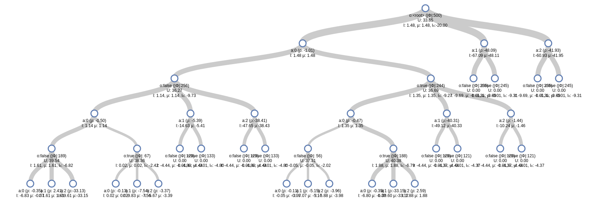

# ARDESPOT

[](https://travis-ci.org/JuliaPOMDP/ARDESPOT.jl) 
[](https://coveralls.io/github/JuliaPOMDP/ARDESPOT.jl?branch=master) 
[](http://codecov.io/github/JuliaPOMDP/ARDESPOT.jl?branch=master)

An implementation of the AR-DESPOT (Anytime Regularized DEterminized Sparse Partially Observable Tree) online POMDP Solver.

Tried to match the pseudocode from this paper: http://bigbird.comp.nus.edu.sg/m2ap/wordpress/wp-content/uploads/2017/08/jair14.pdf as closely as possible. Look there for definitions of all symbols.

Problems use the [POMDPs.jl generative interface](https://github.com/JuliaPOMDP/POMDPs.jl).

If you are trying to use this package and require more documentation, please file an issue!

## Installation

```julia
Pkg.add("POMDPs")
import POMDPs
POMDPs.add("ARDESPOT")
```

## Usage

```julia
using POMDPs, POMDPModels, POMDPToolbox, ARDESPOT

pomdp = TigerPOMDP()

solver = DESPOTSolver(bounds=(-20.0, 0.0))
planner = solve(solver, pomdp)

for (s, a, o) in stepthrough(pomdp, planner, "sao", max_steps=10)
    println("State was $s,")
    println("action $a was taken,")
    println("and observation $o was received.\n")
end
```

For minimal examples of problem implementations, see [this notebook](https://github.com/JuliaPOMDP/BasicPOMCP.jl/blob/master/notebooks/Minimal_Example.ipynb) and [the POMDPs.jl generative docs](http://juliapomdp.github.io/POMDPs.jl/latest/generative/).

## Solver Options

Solver options can be found in the `DESPOTSolver` docstring:

```julia
julia> ?DESPOTSolver
...
  epsilon_0       :: Float64
  xi              :: Float64
  K               :: Int64
  D               :: Int64
  lambda          :: Float64
  T_max           :: Float64
  max_trials      :: Int64
  bounds          :: Any
  default_action  :: Any
  rng             :: AbstractRNG
  random_source   :: ARDESPOT.DESPOTRandomSource
  bounds_warnings :: Bool
```

Each can be set with a keyword argument in the DESPOTSolver constructor. The definitions of the parameters match as closely as possible to the corresponding definition in the pseudocode of [this paper](http://bigbird.comp.nus.edu.sg/m2ap/wordpress/wp-content/uploads/2017/08/jair14.pdf).

### Bounds

Bounds can be specified as a tuple `(lower_bound, upper_bound)`, where the lower and upper bounds are one of
- a number
- a function `f` - in this case `f(pomdp, b::ScenarioBelief)` is called to determine the bound.
- an object `bound` - in this case `ARDESPOT.lbound(bound, pomdp, b::ScenarioBelief)` or `ARDESPOT.ubound(...)` will be called to determine the bound.

To access the state particles in a `ScenairoBelief` `b`, use `particles(b)` (or `collect(particles(b))` to get a vector).

A common lower bound strategy is to use a rollout policy. This is provided by the `DefaultPolicyLB` type, for example
```julia
DESPOTSolver(bounds=(DefaultPolicyLB(RandomSolver(), 0.0)))
```
will use a random rollout policy to calculate a lower bound.

Bounds need not be calculated independently; a single object or function that returns a tuple can be passed to the `bounds` argument. More examples can be found in [src/bounds.jl](). File an issue if more documentation is needed.

## Visualization

[D3Trees.jl](https://github.com/sisl/D3Trees.jl) can be used to visualize the search tree, for example

```julia
using POMDPs, POMDPModels, D3Trees, ARDESPOT

pomdp = TigerPOMDP()

solver = DESPOTSolver(bounds=(-20.0, 0.0))
planner = solve(solver, pomdp)
b0 = initial_state_distribution(pomdp)

tree = ARDESPOT.build_despot(planner, b0)
inchrome(D3Tree(tree, init_expand=5))
```
will create an interactive tree that looks like this:



## Relationship to DESPOT.jl

[DESPOT.jl](https://github.com/JuliaPOMDP/DESPOT.jl) was designed to exactly emulate the [C++ code](https://github.com/AdaCompNUS/despot) released by the original DESPOT developers. This implementation was designed to be as close to the pseudocode from the journal paper as possible for the sake of readability. ARDESPOT has a few more features (for example DESPOT.jl does not implement regularization and pruning), and has more compatibility with a wider range of POMDPs.jl problems because it does not emulate the C++ code.
